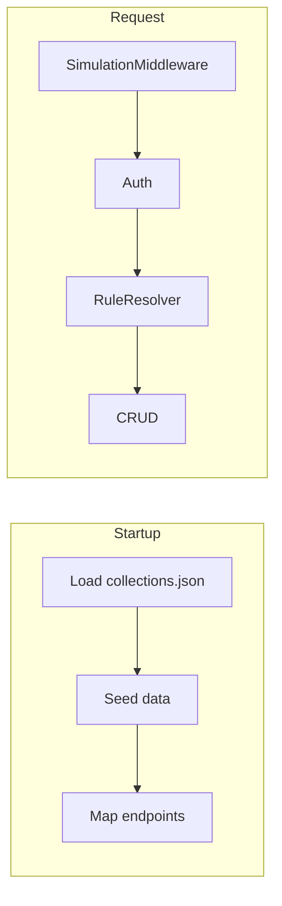

# MMLib.DummyApi – Project Description

## Purpose

MMLib.DummyApi is a **dynamic REST API** for integration testing, benchmarking, and UI mocking. It allows developers to quickly spin up realistic mock APIs without writing backend code.

## Problem It Solves

- **Integration testing**: Mock backends without real services
- **Benchmarking**: Performance and payload tests
- **UI mocking**: Frontend development against realistic data

Define collections via JSON schema, get CRUD endpoints, auto-generated fake data, response rules, and simulation capabilities out of the box.

## Main Features

| Feature | Description |
| ------- | ----------- |
| Dynamic Collections | Define collections with JSON schemas at startup or via API |
| AutoBogus Integration | Realistic fake data from field names (e.g. `firstName`, `email`, `price`) |
| Response Rules | Mockoon-style template rules with conditions and custom responses |
| Simulation Headers | Retry, delay, error, and chaos simulation on any endpoint |
| Background Jobs | Simulate async processing with configurable field updates |
| Per-collection OpenAPI | Each collection gets its own endpoints visible in Scalar |
| Docker Ready | Mount collections file and run anywhere |
| API Key Auth | Optional `X-Api-Key` per collection |
| JSON Schema Validation | Validate create/update against schema |

## Architecture

### Feature-Based Layout

```text
Features/
├── Custom/     – Collections, CRUD, rules, background jobs
├── System/     – Reset, health
└── Performance/ – Payload generation, counter

Infrastructure/ – SimulationMiddleware, ApiKeyAuthHandler, BackgroundJobService
Configuration/  – DummyApiOptions
```

### Core Components

| Component | Role |
| --------- | ---- |
| CustomDataStore | In-memory LiteDB, collection definitions, CRUD |
| CustomCollectionService | Business logic, validation, CRUD |
| RuleResolver | Evaluates rules and returns matching responses |
| AutoBogusSeeder | Generates fake data from JSON Schema |
| JsonSchemaValidator | Validates entities against schema |
| BackgroundJobService | Hosted service, timer-based job execution |
| DynamicEndpointMapper | Maps per-collection endpoints at startup |
| SimulationMiddleware | Retry, delay, chaos, error simulation |
| CollectionOpenApiTransformer | Adds schemas and examples to OpenAPI |

### Data Flow



1. **Startup**: `LoadAndMapCollections` reads `collections.json` → definitions → seed → map endpoints
2. **Request**: `SimulationMiddleware` → auth → `RuleResolver` (if rules) → CRUD
3. **POST create**: Optional background job scheduled → entity returned → job runs after delay

## API Surface

### Collection Management

- `GET /custom/_definitions` – List all collection definitions
- `GET /custom/_definitions/{name}` – Get collection definition
- `POST /custom/_definitions` – Create new collection
- `PUT /custom/_definitions/{name}` – Update collection definition
- `DELETE /custom/_definitions/{name}` – Delete collection

### Dynamic Collection Endpoints

For each collection (e.g. `products`):

- `GET /products` – List all items
- `GET /products/{id}` – Get item by ID
- `POST /products` – Create item
- `PUT /products/{id}` – Update item
- `DELETE /products/{id}` – Delete item

### System

- `POST /reset` – Reset all collections
- `POST /reset?collection=products` – Reset specific collection
- `GET /health` – Health check

### Performance

- `GET /perf/payload?size=1mb` – Generate payload
- `GET /perf/counter` – Get counter value
- `POST /perf/counter/increment` – Increment counter

## Storage

- **LiteDB** in-memory for entities
- **ConcurrentDictionary** for collection definitions
- Entities stored as `BsonDocument`; API exposes JSON with `id` instead of `_id`

## Response Rules

- Evaluated by `RuleResolver` before CRUD
- **Condition sources**: `query`, `header`, `body`, `path`
- **Operators**: `equals`, `contains`, `startsWith`, `endsWith`, `greaterThan`, `lessThan`, `range`, `exists`, `notExists`
- First matching rule (by priority) wins

## Simulation Headers

| Header | Description |
| ------ | ----------- |
| `X-Simulate-Delay: 500` | Add 500ms delay |
| `X-Simulate-Error: true` | Return 500 error |
| `X-Simulate-Retry: 3` | Fail first N-1 requests |
| `X-Request-Id: unique-id` | Track retry requests |
| `X-Chaos-FailureRate: 0.3` | 30% chance of 500 |
| `X-Chaos-LatencyRange: 100-500` | Random delay in range |
| `X-Background-Delay: 5000` | Override background job delay |

## Background Job Operations

| Operation | Example | Description |
| --------- | ------- | ----------- |
| sequence | `sequence:pending,processing,completed` | Cycle through values |
| sum | `sum:items.price` | Sum array field values |
| count | `count:items` | Count array items |
| timestamp | `timestamp` | Set current UTC time |
| random | `random:1,100` | Random number in range |

## Deployment

- **Standalone app**: Not published as a NuGet package; run as ASP.NET Core Web app
- **Docker**: `docker run -p 8080:8080 burgyn/mmlib-dummyapi`
- **Custom collections**: Mount JSON file and set `DUMMYAPI__COLLECTIONSFILE`

## License

MIT License – Copyright (c) 2026 Miňo Martiniak.
